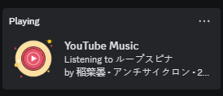

# YouTube Music Desktop App

A simple desktop application for **YouTube Music**.

---
**YouTube Music Player**


**Discord Rich Presence**



---

## Features

- **Desktop YouTube Music**: A dedicated YouTube Music app with no distractions.
- **Minimize to Tray**: Close the app window to minimize it to the system tray.
- **Dicord Rich Presence**: Sets Discord Profile status to current song that plays.
- **Upcoming WebSocket Integration**: A future update will implement WebSocket functionality, allowing users to use Discord Rich Presence without needing additional setup.
---

## Get Started

### How to Use:

1. **Download the Installer**:
   - Visit the [Releases](https://github.com/nubsuki/YouTube-Music-Player/releases) page and download the latest version of the app installer: `YouTube Music Setup.exe`.

2. **Install the Application**:
   - Run the setup file and follow the on-screen instructions to install the app.

3. **Launch the App**:
   - Once installed, you can start the app and enjoy YouTube Music on your desktop! 🎉

---

## Discord Rich Presence Setup

To enable **Discord Rich Presence**, follow these steps:

1. **Create an Application on the Discord Developer Portal**:
   - Go to the [Discord Developer Portal](https://discord.com/developers/applications) and create a new application.

2. **Set Up Rich Presence**:
   - Give your application a name, then navigate to the **Rich Presence** section.
   - Upload an icon for your app (in PNG format).

3. **Get Your Client ID**:
   - Go to the **OAuth2** section and copy the **Client ID**.
   - Open the `config.json` file located in the installed directory: `YouTube Music\resources\app.asar.unpacked\config.json`.
   - Paste your **Client ID** into the `clientId` field.

For example:

```json
{
    "clientId": "1232432411312314"
}
```

4. **Save and Restart**:
   - Save the changes and restart the app. Your Discord profile should now show the current song playing!

---

## License
This project is for personal use and is distributed "as-is".

---