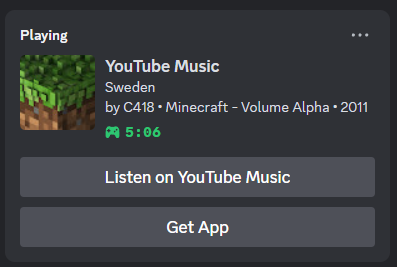

# YouTube Music Desktop App

A simple desktop application for **YouTube Music**.

    

---
**YouTube Music Player**

**Discord Rich Presence**
- **Your Profile Status Preview:**

- **How Others See Your Status:**

---

## Features

- **Desktop YouTube Music**: A dedicated YouTube Music app with no distractions.
- **Minimize to Tray**: Close the app window to minimize it to the system tray.
- **Dicord Rich Presence**: Sets Discord Profile status to current song that plays.
- **Listen on YouTube**: Other users who see your profile status can search for the current song by pressing **"Listen on YouTube"**. 
- **YouTube Ad Blocker**: Blocks YouTube ads inside the app with a handy toggle to turn it on/off.
---

## Get Started

### How to Use:

1. **Download the Installer**:
   - Visit the [Releases](https://github.com/nubsuki/YouTube-Music-Player/releases) page and download the latest version of the app installer: `YouTube Music Setup.exe`.

2. **Install the Application**:
   - Run the setup file and follow the on-screen instructions to install the app.

3. **Launch the App**:
   - Once installed, you can start the app and enjoy YouTube Music on your desktop! 🎉

### Linux
- Make sure fuse2 is installed
- **Discord Rich Presence** might not work perfectly on all systems.

> ### Notes
> **Worried about account bans due to ad blocking?**
> Use a **burner account/email** or **just don't tun on**, or stick with **v1.4.0** — that version doesn’t include any ad-blocker functionality.
---

## License
- This software is provided "as-is" without any warranties or guarantees. 
- It is for personal use only.
- licensed under the [Apache License 2.0](https://www.apache.org/licenses/LICENSE-2.0)
- adblocker-electron [`@ghostery/adblocker-electron`](https://github.com/cliqz-oss/adblocker)

---